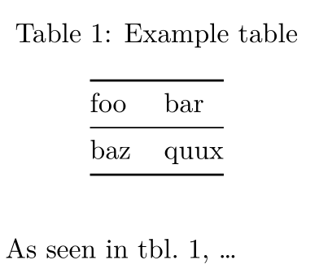
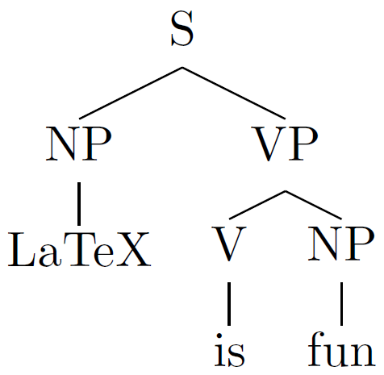
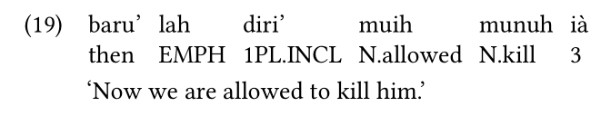

# 簡介

## 大綱

- 學術論文撰寫工具
- Pandoc
  - Pandoc 使用方式
  - Pandoc 與語言學
  - Pandoc 的工具
- Pandoc 的優缺點

## 關於我

- 清大語言所博士候選人
- 用 Linux 已有十幾年
- 學過 Python 和 Haskell

# 學術論文撰寫工具

## 文書處理器 vs LaTeX

| 文書處理器               | LaTeX                        |
|--------------------------|------------------------------|
| 較好上手                 | 較難上手                     |
| 排版容易跑掉             | 為排版而生                   |
| 適合較短篇的文件<br>（幾頁） | 適合較長篇的文章<br>（十幾頁UP） |
| 邊寫邊排版               | 撰寫與排版分工               |

## 語言學文章的需求

- 嵌入參考文獻
- Syntax trees / Optimality Theory tableaux
- Interlinear glossing
- Cross-referencing
- Unicode （中文、國際音標）

## 科學家為何要用自由軟體？

- 資料以開放的格式儲存
  - 易匯出、分享
- 價錢
- 個人化

## 文科：<br>只有肥宅才會用LaTeX吧！

- 以 Markdown 代 LaTeX！

## 什麼是 Markdown？

- Markdown 不是程式，
  <br>是文字格式化的方式
- 需要編譯
- 原始檔可以直接看

## Markdown 語法

:::::::::::::: {.columns}
::: {.column width="40%"}
    *italic*

    **bold**
    
    | foo | bar  |
    |-----|------|
    | baz | quux |
:::
::: {.column width="40%"}
*italic*

**bold**

| foo | bar  |
|-----|------|
| baz | quux |
:::
::::::::::::::

## Markdown 不只一種！

- Pandoc Markdown
- Commonmark
- Github-flavoured Markdown

# Pandoc

## 什麼是 Pandoc？

- 格式轉換神器
- 柏克萊大學教授 John MacFarlane 所創
- 支援 LaTeX 與 Markdown
- 可輸出 PDF、docx、HTML 等等
- 這份簡報：Markdown 轉 reveal.js

## Pandoc Markdown 的特色

- YAML metadata blocks
- 參考文獻：透過Bib(La)TeX
- Cross-referencing
- Inline LaTeX: 需要時，可用LaTeX的力量

## YAML metadata block

```yaml
---
title:  'This is the title: it contains a colon'
author:
- Author One
- Author Two
keywords: [nothing, nothingness]
abstract: |
  This is the abstract.

  It consists of two paragraphs.
...
```

## Bibliography with Pandoc

(需要用 `pandoc-citeproc` 過濾器）

:::::::::::::: {.columns}
::: {.column width="50%"}

bibliography.bib

```bibtex
@book{prince2004,
  address = { Malden, MA },
  author = { Prince, Alan and Smolensky, Paul },
  isbn = { 978-1-4051-1932-0 978-1-4051-1933-7 },
  publisher = { Blackwell Pub },
  title = { Optimality Theory: Constraint Interaction in Generative Grammar },
  year = { 2004 },
}
```

:::
::: {.column width="50%"}

article.md

```yaml
---
bibliography: bibliography.bib
...
```

```markdown
Constraints choose an optimal
candidate [@prince2004].
```
:::
::::::::::::::

## Cross-referencing

(需要用 `pandoc-crossref` 過濾器）

:::::::::::::: {.columns}
::: {.column width="50%"}
```markdown
: Example table {#tbl:foo}

| foo | bar  |
|-----|------|
| baz | quux |

As seen in @tbl:foo, ...
```
:::
::: {.column width="50%"}

:::
::::::::::::::

# Inline LaTeX for linguists

## Syntax trees

:::::::::::::: {.columns}
::: {.column width="60%"}
```latex
header-includes: |
  \usepackage{qtree}

\Tree [.S [.NP LaTeX ]
      [.VP [.V is ] [.NP fun ] ] ]
```
:::
::: {.column width="40%"}

:::
::::::::::::::

## Glossing

```latex
header-includes: |
  \usepackage{gb4e}

\begin{exe}
\ex
\gll baru' lah diri' muih munuh ià\\
     then EMPH 1PL.INCL N.allowed N.kill 3\\
\trans `Now we are allowed to kill him.'
\end{exe}
```



# 工具

## 工具一覽

- 文字編輯器
- PDF 輸出：LaTeX + Pandoc

## 文字編輯器

- Emacs
- Vim
- Notepad++
- Atom
- VS Code

## Pandoc

- 命令列介面 (CLI)
- 可另外裝圖形介面

# 總結

## 優缺點

:::::::::::::: {.columns}
::: {.column width="50%"}
優點：

- 自由軟體！
- 原始檔是純文字
- 適合用 Git
  - 版本控制
  - 輕易合作
- 較少 bug
:::
::: {.column width="50%"}
缺點：

- 需要花時間學習
- 偶爾需用到 LaTeX
- 命令列介面
:::
::::::::::::::

## 如何開始用 Pandoc?

前往 https://pandoc.org/getting-started.html

閱讀說明書 https://pandoc.org/MANUAL.html

# 謝謝！
